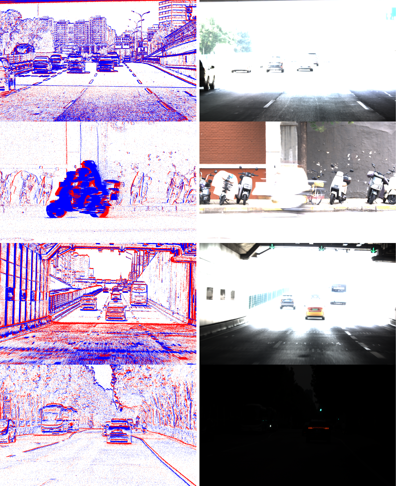

# PEOD: Pixel-aligned Event-RGB Object Detection Dataset

<div align="center">

[](https://EchosLiu.github.io/PEOD-dataset/)
[](https://EchosLiu.github.io/PEOD-dataset/)
[](https://EchosLiu.github.io/PEOD-dataset/)

[**🚀 View Interactive Demo**](https://EchosLiu.github.io/PEOD-dataset/) | [**📖 Documentation**](https://EchosLiu.github.io/PEOD-dataset/) | [**💾 Download**](https://EchosLiu.github.io/PEOD-dataset/)

</div>

---

## 🎯 Overview

**PEOD** is the first large-scale dataset providing synchronized high-resolution event streams and RGB images for object detection under challenging conditions. This groundbreaking dataset addresses the critical need for robust perception systems that can operate reliably across diverse environmental conditions, particularly in scenarios where traditional frame-based sensors struggle.

<div align="center">

</div>

### 🔬 Key Contributions

- **🎥 High-Resolution Multimodal Data**: 1280×720 pixel-aligned event streams and RGB frames captured using a coaxial dual-camera system
- **🌍 Comprehensive Coverage**: 120+ driving sequences across urban, suburban, and tunnel environments
- **🌙 Challenging Conditions**: 57% of data collected under low light, overexposed, or high-speed conditions
- **🏷️ Rich Annotations**: 340k manually verified bounding boxes across six object classes
- **⚡ High Dynamic Range**: Event camera with >87 dB HDR for extreme illumination scenarios

## 📊 Dataset Statistics

| **Metric** | **Value** | **Description** |
|------------|-----------|-----------------|
| **Resolution** | 1280×720 | High-resolution pixel-aligned streams |
| **Sequences** | 120+ | Diverse driving scenarios |
| **Total Frames** | 72k | Synchronized RGB and event data |
| **Annotations** | 340k | Manually verified bounding boxes |
| **Frequency** | 30 Hz | High-frequency data capture |
| **Classes** | 6 | car, bus, truck, two-wheeler, three-wheeler, person |
| **Dynamic Range** | >87 dB | Event camera HDR capability |

### 📈 Data Distribution

| **Split** | **Annotations** | **Characteristics** |
|-----------|-----------------|-------------------|
| **Training** | 270k boxes | Diverse illumination & motion conditions |
| **Testing** | 70k boxes | Held-out sequences for benchmarking |


## 📁 Dataset Structure

```
PEOD/
├── train/
│   ├── sequence_001/
│   │   ├── rgb/              # RGB frames (PNG format)
│   │   ├── events.dat        # Event stream data
│   │   └── boxes.npy         # Bounding box annotations
│   ├── sequence_002/
│   └── ...
├── test/
│   └── [similar structure]
└── metadata/
    ├── class_names.txt       # Object class definitions
    ├── statistics.json       # Dataset statistics
    └── splits.json          # Train/test split information
```

## 🎯 Object Classes

The dataset includes six carefully selected object classes relevant to autonomous driving:

| **Class** | **Description** | **Typical Scenarios** |
|-----------|-----------------|----------------------|
| **Car** | Standard passenger vehicles | Urban/suburban driving |
| **Bus** | Public transportation vehicles | City centers, bus routes |
| **Truck** | Commercial vehicles | Highways, industrial areas |
| **Two-wheeler** | Motorcycles, bicycles | Urban intersections |
| **Three-wheeler** | Auto-rickshaws, tricycles | Developing urban areas |
| **Person** | Pedestrians | Crosswalks, sidewalks |

## 🌟 Unique Features

### 🔄 Perfect Pixel Alignment
Our coaxial dual-camera system ensures precise spatial correspondence between event and RGB data, enabling accurate multimodal fusion.

### 🌓 Challenging Conditions
- **Low light scenarios**: Twilight, dawn, underground passages
- **High-speed motion**: Highway driving, rapid camera movements  
- **Extreme illumination**: Direct sunlight, headlight glare, tunnel exits

### ⚡ Event Camera Advantages
- **High temporal resolution**: Microsecond precision
- **High dynamic range**: >87 dB vs ~60 dB for standard cameras
- **Motion blur immunity**: Sharp perception during rapid movement
- **Low latency**: Real-time perception capabilities

## 📥 Download & Access

> 🚧 **Dataset Release**: The PEOD dataset will be publicly available soon. Please check our [project page](https://EchosLiu.github.io/PEOD-dataset/) for the latest updates.

**Planned Formats:**
- **RAW format**: Unprocessed event and RGB data
- **DAT format**: Preprocessed event representations
- **Annotations**: NumPy arrays with bounding box coordinates

## 📚 Citation

If you use PEOD in your research, please cite our paper:

```bibtex
@inproceedings{peod2025,
  title={PEOD: Pixel-aligned High-Resolution Event-RGB Dataset for Challenging Object Detection},
  author={[Authors]},
  booktitle={Proceedings of the AAAI Conference on Artificial Intelligence},
  year={2026},
  note={To appear}
}
```

## 🤝 Contributing

We welcome contributions to improve the dataset and benchmark! Please see our [project page](https://EchosLiu.github.io/PEOD-dataset/) for contribution guidelines.

## 📄 License

This dataset is released under [License to be specified]. Please refer to our [project page](https://EchosLiu.github.io/PEOD-dataset/) for detailed licensing information.

## 📞 Contact

For questions, suggestions, or collaboration opportunities:

- **Project Page**: [https://EchosLiu.github.io/PEOD-dataset/](https://EchosLiu.github.io/PEOD-dataset/)
- **Issues**: Please use GitHub Issues for technical questions
- **Email**: lpcui@bupt.edu.cn

---

<div align="center">

**🌟 Star this repository if you find PEOD useful for your research! 🌟**

[](https://github.com/PEOD-dataset/PEOD-dataset/stargazers)
[](https://github.com/PEOD-dataset/PEOD-dataset/network/members)

</div>
